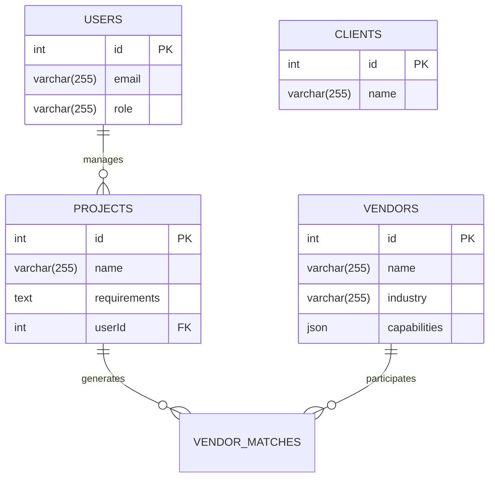

# Database Schema Overview

## Entity Relationship Diagram

## Tables Description
### Users Table
- Stores platform users and administrators
- Roles: ADMIN, MANAGER, VIEWER

### Clients Table
- Stores client information

### Projects Table
- Tracks client expansion projects
- Contains technical requirements and scoring criteria

### Vendors Table
- Maintains vendor profiles and capabilities
- Uses JSON field for dynamic attribute storage
