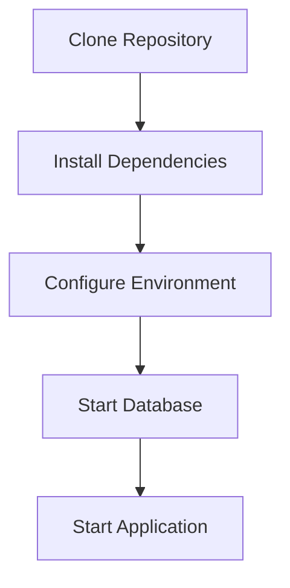

# Global Expansion Platform Setup Guide (v2)

## Local Development Requirements
- Node.js v18+
- MySQL 8.0+
- Redis 6.2+
- MongoDB 4.4+
- Mailgun account with SMTP credentials
- Docker Desktop (optional)

## Docker Setup
- Use docker-compose.yml and DockerFile for local development

## Environment Variables for docker
```ini

PORT=3000
# mysql Database
MYSQL_HOST=mysql-db
MYSQL_PORT=3306
MYSQL_USER=root
MYSQL_PASSWORD=1234
MYSQL_DATABASE=mysql_expanderdb

# mongo Database
MONGO_URI=mongodb://mongo-db:27017/myappdb

# JWT Authentication
JWT_SECRET=SSdd55TT12387nhjJ
JWT_EXPIRATION=1d


# Mailgun API Configuration
MAILGUN_API_KEY=<YOUR_MAILGUN_API_KEY>
MAILGUN_DOMAIN=<YOUR_MAILGUN_DOMAIN>
MAIL_FROM_EMAIL=<YOUR_MAIL_FROM_EMAIL>
MAIL_FROM_NAME=<YOUR_MAIL_FROM_NAME>


# Run match refresh every minute for testing
MATCH_REFRESH_CRON=*/1 * * * *
# Run SLA check every minute for testing
SLA_CHECK_CRON=*/1 * * * *

# For production, you can use:
# MATCH_REFRESH_CRON=0 3 * * *   # 3 AM daily
# SLA_CHECK_CRON=0 4 * * *       # 4 AM daily
```

- To start the application in docker:
```bash
npm run docker-compose up --build
```

- To stop the application in docker:
```bash
npm run docker-compose down
```

## Environment Variables for local machine
```ini

PORT=3000
# mysql Database
MYSQL_HOST=localhost
MYSQL_PORT=<YOUR_MYSQL_PORT>
MYSQL_USER=<YOUR_MYSQL_USER>
MYSQL_PASSWORD=<YOUR_MYSQL_PASSWORD>
MYSQL_DATABASE=<YOUR_MYSQL_DATABASE>

# mongo Database
MONGO_URI=mongodb://localhost:27017/<YOUR_MONGO_DATABASE>

# JWT Authentication
JWT_SECRET=<YOUR_JWT_SECRET>
JWT_EXPIRATION=<YOUR_JWT_EXPIRATION>


# Mailgun API Configuration
MAILGUN_API_KEY=<YOUR_MAILGUN_API_KEY>
MAILGUN_DOMAIN=<YOUR_MAILGUN_DOMAIN>
MAIL_FROM_EMAIL=<YOUR_MAIL_FROM_EMAIL>
MAIL_FROM_NAME=<YOUR_MAIL_FROM_NAME>


# Run match refresh every minute for testing
MATCH_REFRESH_CRON=*/1 * * * *
# Run SLA check every minute for testing
SLA_CHECK_CRON=*/1 * * * *

# For production, you can use:
# MATCH_REFRESH_CRON=0 3 * * *   # 3 AM daily
# SLA_CHECK_CRON=0 4 * * *       # 4 AM daily
```


## Development Workflow


- To start the application in local machine:
```bash
npm run start:dev
```
or 
```bash
npm run start:dev:nodemon
```